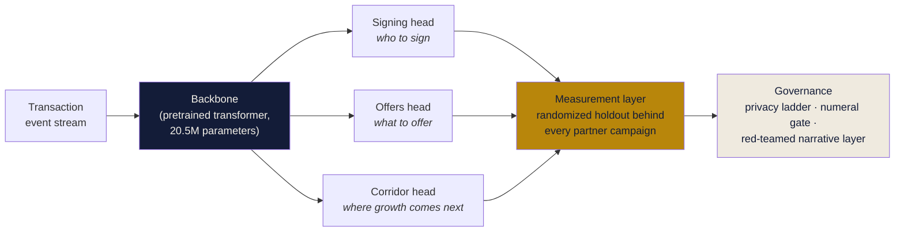
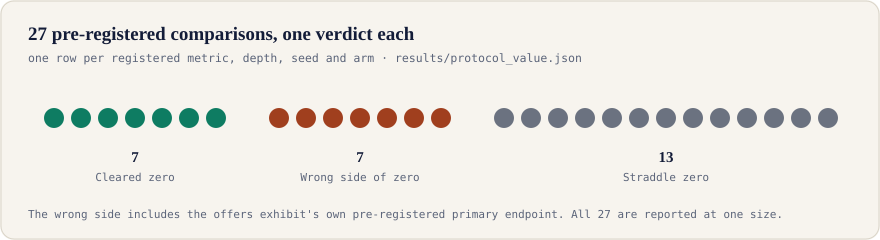
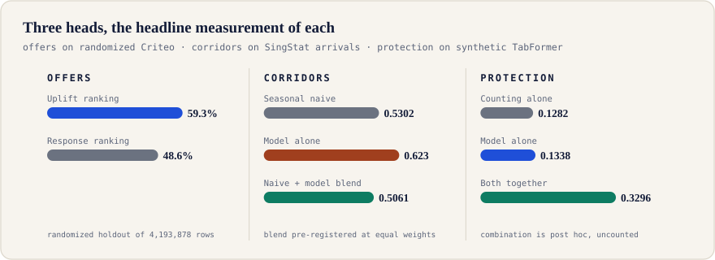
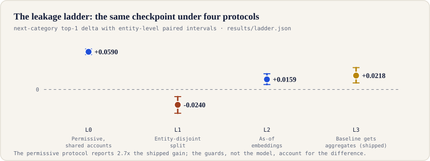

# One Loop

**One transaction backbone serving three growth heads, with a measurement layer that certifies lift instead of asserting it.**

Entry for the AMEX AI Hackathon 2026 (Growth theme) by Team WGG, National University of Singapore. The interactive entry, with every figure bound to a committed results file, is published at **[thylinao1.github.io/oneloop-site-k7q2](https://thylinao1.github.io/oneloop-site-k7q2/)**.

This repository holds the pipeline that produced every number in the entry: the pretraining and evaluation code, the frozen result files, and the pre-registrations that were committed before the runs they govern.

---

## The system in one diagram



The scarce resource in payments AI is a number that still stands after an audit, rather than another model. The apparatus that produces such numbers is the part of this project we built: every comparison that matters was pre-registered before its run, every result file is committed, and the losses are reported at the same size as the wins.

## Self-assessment, before anything else

27 pre-registered comparisons in this project carry an interval, one row per metric, depth, seed and arm the pre-registrations named. 7 cleared zero, 7 landed on the wrong side of it, and 13 straddle it.



## The three heads



| Head | Question | Corpus | Headline result | What did not hold |
|---|---|---|---|---|
| **Offers** | what to offer | Criteo uplift (real, randomized, 4,193,878 holdout rows) | Uplift ranking captures **59.3%** of incremental visits at one tenth of the reach, against 48.6% for response ranking; the paired difference of +0.011 visits per customer has an interval entirely above zero | On conversion, the pre-registered primary endpoint, the same ranking loses at every depth |
| **Corridors** | where growth comes next | SingStat monthly visitor arrivals (real, 12 corridors, 13 held-out months) | Adding the model to the seasonal naive at pre-registered equal weights improves macro MASE from 0.5302 to **0.5061** | The model alone (0.6230) is worse than the naive it is added to; totalled in arrivals the naive stays ahead |
| **Protection** | fraud scoring, label-free | IBM TabFormer (synthetic, 24M transactions) | Combining the backbone's surprise score with a counting control raises fraud PR-AUC from 0.1282 to **0.3296** | The model alone (0.1338) does not separate from counting; the combination was built after the first run and is counted in no pre-registered total |

## The evaluation protocol

One frozen checkpoint was read under four protocols, with the guards turned on one step at a time. The permissive number is 2.7 times the shipped number, and the guards, not the model, account for the difference.



The four rungs, in `scripts/fm/ladder_eval.py`:

1. **L0** temporal split only, shared accounts, pooled embeddings that see the scored row
2. **L1** entity-disjoint split (the gain turns negative)
3. **L2** as-of, prefix-only embeddings
4. **L3** the baseline is additionally equipped with per-entity temporal aggregates. This is the shipped protocol.

## The generated-text layer

Every ranked list and lift report leaves with a narrative written by a self-hosted model over committed numbers, never over free text. Three deterministic layers stand behind it:

| Layer | Check | Code |
|---|---|---|
| One | every numeral in the text is carried by a fact in the bundle | `scripts/narratives/faithcheck.py` |
| Two | a model cross-examination of each claim against the facts | `scripts/narratives/check.py` |
| Three | the direction of each comparison (which side won) | `scripts/narratives/directioncheck.py` |

Our own red team ran seven attack classes against this gate (`scripts/safety/injection_redteam.py`). Two of seven attack classes beat the gate; the pool-pollution hole was fixed and re-measured (`scripts/safety/test_injection_fix.py`), and the residual rates ship in `results/safety_injection.json`. The direction layer fails 5 of the 10 bundles it can read and refuses to pass the other 20; those failures are reported, not regenerated.

## Privacy and safety, priced

- **Privacy ladder** (`scripts/safety/privacy_ladder.py`): each guard is priced one rung at a time on the metric a partner acts on. Small-cell suppression costs zero churn at the head; contribution bounding and calibrated noise cost 10 and 17.7 points of top-twenty churn.
- **Membership inference** (`scripts/safety/mia_eval.py`): the model arm recovers 0.2724 of member accounts at the smallest measurable false-positive floor. The honest negative is printed beside it: counting transactions with no model recovers 0.9689, so the measured exposure is a confound of tenure, not memorization.
- **Control plane** (`scripts/safety/control_plane_conformance.py`): the agent control plane is designed and checked for conformance, not built; the layer explains scores and reports and never makes a decision.

## Data provenance

| Corpus | Kind | Used by |
|---|---|---|
| Criteo Uplift v2.1 | real, randomized experiment | offers head |
| Hillstrom e-mail experiment | real, randomized experiment | offers head |
| SingStat monthly visitor arrivals | real, observational | corridor head |
| Foursquare OS Places (SG slice) | real, observational | signing head |
| dunnhumby Complete Journey | real, observational | replication of the transfer question |
| IBM TabFormer | synthetic | backbone pretraining, protection, ladder |

All three heads are prototyped on real public data; the backbone corpus is the synthetic part. Every exhibit in the entry carries the same real or synthetic mark. Nothing here measures American Express exposure: each result measures a mechanism on a public corpus.

## Repository layout

```
prereg/     pre-registrations, committed before the runs they govern
scripts/    the pipeline: backbone, heads, evaluation ladder, safety, narratives
results/    frozen result files; every figure in the entry is bound to a path here
citations.json  external claims with their sources
docs/assets/    the charts embedded in this file, generated from results/
```

- `prereg/` holds eight pre-registration documents. Each fixes its metrics, arms, splits and abort criteria before the first run, and each states that the result ships whichever way it lands.
- `results/` is append-only in spirit: a result, once produced under its pre-registration, is not regenerated to read better. The wrong-side results in the scoreboard above are still here.
- A map of the scripts, in pipeline order, is in [`scripts/README.md`](scripts/README.md).

## Compute and cost

The full training and evaluation footprint was metered from cluster accounting (`scripts/cost_model.py`, `results/cost_model.json`): 8.1 GPU hours and 131 CPU core hours, a market equivalent of **US$27.56** at cited public on-demand rates, with cash outlay of US$0 on a university cluster. Failed and cancelled runs are included in the total.

## Reproduction

The pipeline ran on a Slurm cluster with A100/H100 GPUs. In outline:

```bash
scripts/fetch_data.sh                 # public corpora, with checksums
sbatch scripts/fm/job_backbone.sbatch # pretrain the backbone (TabFormer)
sbatch scripts/fm/job_ladder.sbatch   # the four-rung evaluation ladder
sbatch scripts/fm/job_protection.sbatch
python scripts/uplift_exhibit.py      # offers head, randomized Criteo
python scripts/corridor_exhibit.py    # corridor head, SingStat
python scripts/whitespace_exhibit.py  # signing head, Foursquare SG
```

Each producer writes one file into `results/` and embeds its seed, library versions and data provenance in the file it writes. Scripts with a reproduction gate refuse to run if the shipped numbers they depend on do not reproduce first.

## Team

Team WGG, National University of Singapore. AMEX AI Hackathon 2026, Growth theme.
